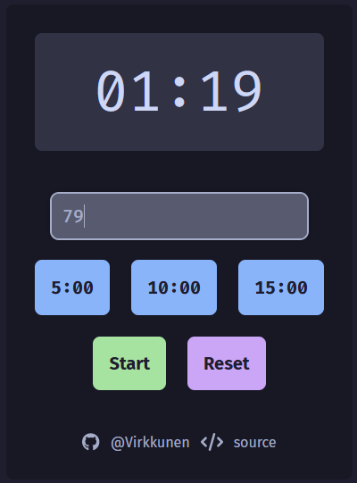
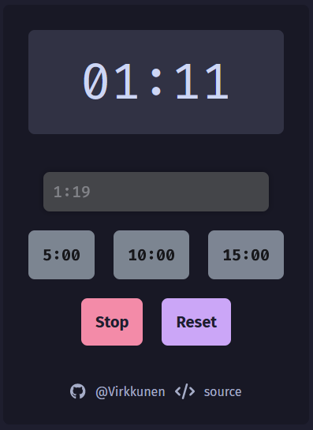

# Timer

A simple timer made with React, TypeScript and TailwindCSS


## Features

- Custom time input `(1:19, 79)`
- Preset buttons 
- Alarm sound when timer is complete
- Responsive layout


## Screenshots





## Demo

[Timer](https://vrkknn.net/timer)


## Run Locally

Clone the project

```bash
  git clone https://github.com/Virkkunen/timer.git
```

Go to the project directory

```bash
  cd timer
```

Install dependencies

```bash
  npm i
```

Start the server

```bash
  npm run dev
```


## Authors

- [@Virkkunen](https://www.github.com/Virkkunen)


## Tech Stack

React, Vite, TypeScript, TailwindCSS


## To Do
- [ ] Display hours instead of minutes
- [ ] Convert hour input (1h19, 1h19m5s)
